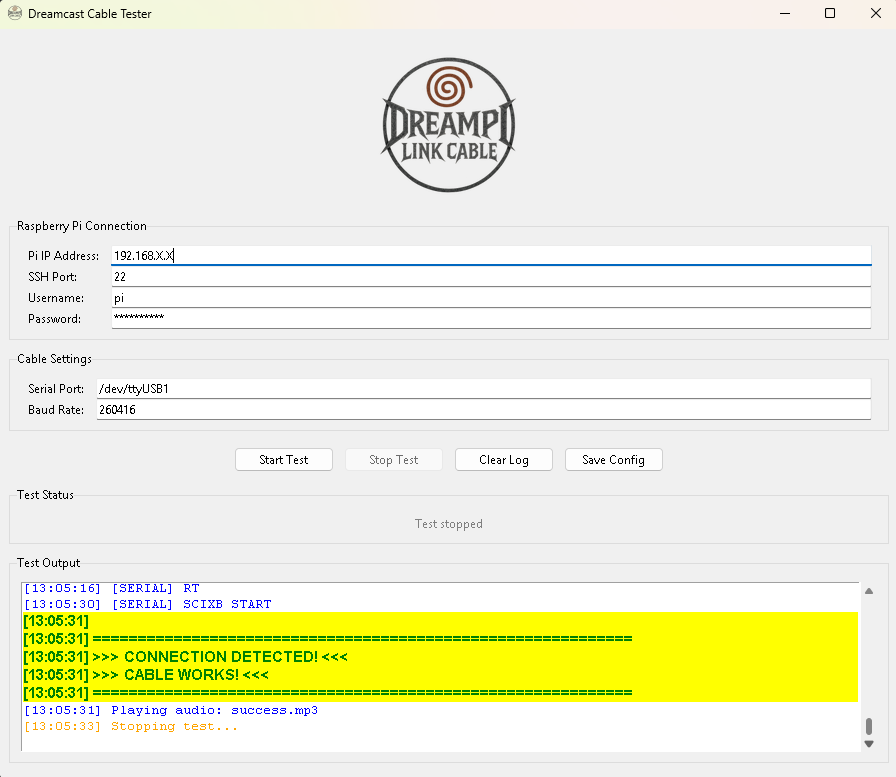

# Dreamcast Cable Tester

GUI application for testing Dreamcast serial cables via SSH connection to a Raspberry Pi running DreamPi or link_cable setup.

## Features

- Monitors serial port data from Dreamcast connections
- Detects SCIXB handshake protocol
- Audio feedback for test results
- Saves connection settings between sessions
- Real-time log output

## Requirements

**Hardware:**
- Dreamcast with CP2102N based USB Coders Cable (Dreamcast serial -> USB)
- Raspberry Pi with cable connected

**Software:**
- Python 3.7 or higher
- SSH access to Raspberry Pi
- Compatible game (VOOT)
- DreamCast Taisen Netplay: https://github.com/eaudunord/dc-taisen-netplay

More info about Taisen Netplay:
https://www.segasaturnshiro.com/2025/09/18/taisen-netplay-brings-new-ways-to-play-your-dreamcast-online/

## Thanks to eaudunord for creating the underlying DreamPi Link Cable system!!

**Python packages:**
```bash
pip install paramiko pygame pillow
```

## Installation

**Running from source:**
```bash
python cable_tester.py
```

**Building standalone executable:**
```bash
pip install pyinstaller
python -m PyInstaller --onefile --windowed --name="DreamcastCableTester" --icon="icon.ico" --add-data="icon.ico;." --add-data="success.mp3;." --add-data="failure.mp3;." cable_tester.py
```

The executable will be created in the `dist` folder.

## Usage

1. Enter Raspberry Pi IP address and SSH credentials
2. Verify serial port path (default: `/dev/ttyUSB0`)
3. Confirm baud rate (default: `260416`)
4. Click "Start Test"
5. Initiate online connection from Dreamcast
6. Monitor results in the log window

The test runs for 120 seconds or until data is detected.

## Raspberry Pi Setup

The script requires:
- `link_cable.py` installed at `/opt/dreampi-linkcable/`
- Python with pyserial
- sudo privileges for the SSH user

## Required Files

- `icon.ico` - Application icon
- `success.mp3` - Played when cable test succeeds
- `failure.mp3` - Played when cable test fails

Files should be in the same directory as the script or bundled with the executable.

## Configuration

Settings are stored in `~/.dreamcast_cable_tester.json` and persist between sessions.

## Troubleshooting

**Connection fails:**
- Verify Pi IP address and credentials
- Check SSH port (default: 22)

**No data detected:**
- Verify cable is connected
- Check serial port path with `dmesg` on Pi
- Confirm baud rate matches cable specification
- Ensure Dreamcast is attempting connection

**False positive detection:**
- Clear buffer files on Pi: `rm /tmp/serial_data.txt /tmp/link_output.log`

**Missing dependencies:**
```bash
pip install paramiko pygame pillow
```

